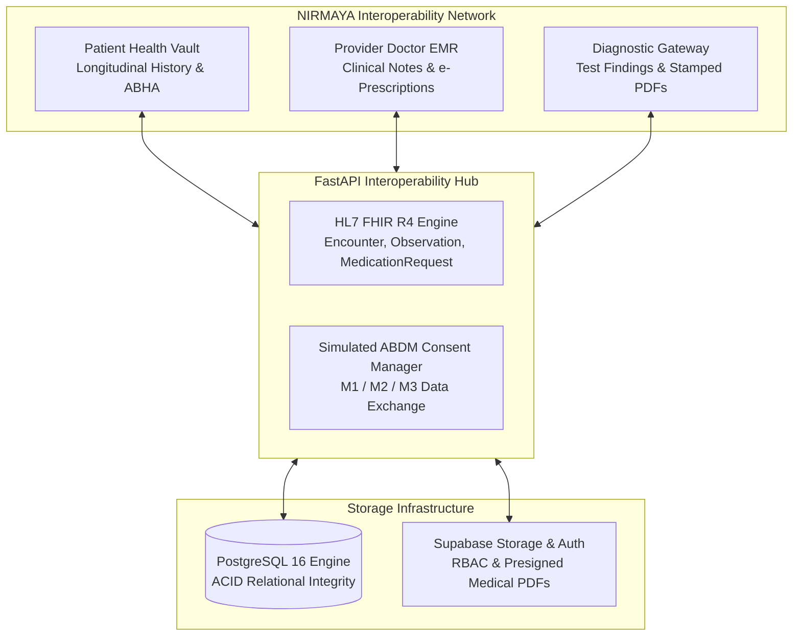

# NIRMAYA: Networked Interoperable Records Medical Assets & Your Archives

<div align="center">

[](https://fastapi.tiangolo.com)
[](https://nextjs.org)
[](https://tailwindcss.com)
[](https://hl7.org/fhir/R4/)
[](https://abdm.gov.in/)
[-brightgreen.svg?style=flat&logo=pytest&logoColor=white)](backend/tests/)
[](LICENSE)

**A Unified Health Interoperability Network & Longitudinal Patient Vault**  
*Built on HL7 FHIR Release 4 and Simulated Ayushman Bharat Digital Mission (ABDM) Standards*

[System Architecture](docs/ARCHITECTURE.md) • [GitBook Documentation](docs/README.md) • [Changelog](docs/CHANGELOG.md) • [API Swagger Docs](http://localhost:8000/docs)

</div>

---

## 1. Executive Summary

**NIRMAYA** is an enterprise-grade digital health interoperability platform designed as a standout final-year major project in Health Informatics. Rather than storing records in isolated, proprietary tables, NIRMAYA structures all patient encounters, diagnostic observations, and pharmaceutical regimens around **HL7 FHIR Release 4** and simulates India's **Ayushman Bharat Digital Mission (ABDM)** ecosystem.

---

## 2. The 3-Pillar Unified Network



- **Patient Health Vault:** A self-sovereign health locker where patients own their complete longitudinal medical history, manage time-bound doctor consent grants, and link simulated 14-digit ABHA IDs.
- **Provider (Doctor) EMR:** A high-efficiency consultation console for verified patient timeline review, vitals recording, and structured e-prescription authoring (`MedicationRequest`).
- **Diagnostic (Lab) Gateway:** A secured channel for accredited laboratories to upload both human-readable PDF reports and machine-readable quantitative observations (`Observation`) directly into patient records.

---

## 3. Technology Stack

| Layer | Technologies | Role & Architectural Rationale |
|---|---|---|
| **Frontend** | Next.js 15 (App Router), React 19, TypeScript, Tailwind CSS v4, Framer Motion | Server-rendered clinical views, responsive layouts, micro-animations |
| **Backend** | FastAPI (Python 3.11/3.12), Pydantic v2, Uvicorn ASGI | High-throughput async routing, strict FHIR validation, sub-ms telemetry |
| **Database** | PostgreSQL 16 via SQLAlchemy 2.0 (ORM) & Alembic | ACID relational integrity, row-level locking for appointment slots |
| **Auth & Storage** | Supabase Auth (RBAC) & Supabase Storage | Role-based JWT validation, presigned short-lived medical PDF URLs |
| **Standards** | HL7 FHIR Release 4, Simulated ABDM M1/M2/M3 | Interoperable JSON Bundles, LOINC, SNOMED-CT code systems |

---

## 4. Quickstart Guide

### Prerequisites
- Python >= 3.11
- Node.js >= 18
- Git

### 1. Run Pre-flight System Diagnostics
```bash
python scripts/doctor.py
```

### 2. Single-Command Concurrent Launch
**Windows (PowerShell):**
```powershell
npm run dev
# Or directly:
.\scripts\run-dev.ps1
```

**POSIX / Linux / macOS (Bash):**
```bash
npm run dev:bash
# Or directly:
./scripts/run-dev.sh
```

### 3. Service Endpoints
- **Frontend Web Portal:** [http://localhost:3000](http://localhost:3000)
- **FastAPI Core Backend:** [http://localhost:8000](http://localhost:8000)
- **Interactive Swagger Docs:** [http://localhost:8000/docs](http://localhost:8000/docs)
- **FHIR Capabilities Statement:** [http://localhost:8000/api/v1/meta](http://localhost:8000/api/v1/meta)
- **System Health & Telemetry:** [http://localhost:8000/api/v1/health](http://localhost:8000/api/v1/health)

---

## 5. Development Roadmap & Discipline

NIRMAYA is developed across a structured **4-Month (16-Week / 80-Day)** schedule. Every working day follows the **10+ Atomic Micro-Commit Rule** adhering strictly to Conventional Commits:

- **Month 1:** Foundation, Database Models, RBAC Auth & Onboarding Profiles (`v0.1.0`)
- **Month 2:** Doctor Discovery, Availability Engine & Concurrency Booking (`v0.2.0`)
- **Month 3:** Clinical EMR, Prescription Generator, Lab Gateway & HL7 FHIR Bundles (`v0.3.0`)
- **Month 4:** Real-Time Sync, Production Hardening, Cloud Deployment & Academic Report (`v1.0.0`)

See [`docs/CHANGELOG.md`](docs/CHANGELOG.md) for the live micro-commit journal.

---

## 6. License & Authorship

- **Author:** Suryansh Swarn
- **Project:** NIRMAYA Health Informatics Major Project
- **License:** MIT
