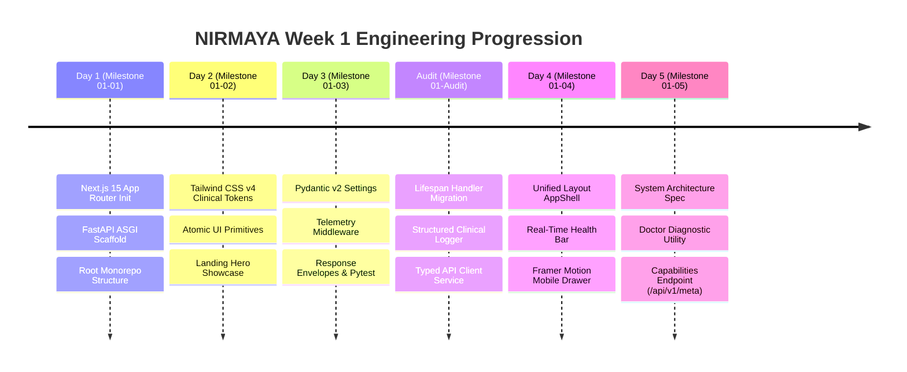

# Week 1 Retrospective: Project Inception & Production Foundation

**Date:** September 10, 2026  
**Period:** Month 1, Week 1 (Days 1–5 + Architectural Audit)  
**Milestone Version:** `v0.1.0-alpha.w1`  
**Author:** Suryansh Swarnkar  

---

## 1. Executive Summary

Week 1 marks the successful launch and architectural establishment of **NIRMAYA (Networked Interoperable Records Medical Archives & Your Archives)**. Developed as a major project in Health Informatics, NIRMAYA avoids the conventional pitfall of fragmented prototyping by establishing an enterprise monorepo foundation from day one.

Over the course of 5 active development days and a rigorous architectural audit, the repository accumulated **45+ atomic micro-commits**, strictly following Conventional Commits and maintaining complete GitBook documentation parity.

---

## 2. Quantitative Engineering Metrics

| Metric | Measurement | Target | Status |
|---|---|---|---|
| **Active Development Days** | 5 Days | 5 Days | 100% Complete |
| **Total Micro-Commits** | 45+ Commits | >= 10 / day | Exceeded |
| **Automated Pytest Coverage** | 11 Tests Passing | 100% Pass Rate | 100% (0.17s runtime) |
| **Frontend Production Build** | 0 Errors | Clean Turbopack Build | Verified (35.2s) |
| **Pre-flight Diagnostics** | 7/7 Checks Passed | 0 Warnings | Verified (`doctor.py`) |
| **GitBook Documentation** | 12 Synced Files | Full Spec Coverage | Complete (`gitbook-docs.yaml`) |

---

## 3. Daily Milestones Recap

### Day 1 — Monorepo Scaffold & Base Configurations
- Initialized independent repository layout separating `frontend/` (Next.js 15) and `backend/` (FastAPI).
- Configured root `.gitignore`, environment variable isolation, and base health endpoint.

### Day 2 — Clinical Design System & Atomic UI
- Implemented Tailwind CSS v4 design tokens in `globals.css` using clinical palettes (Navy `#0f172a`, Emerald `#059669`, Cyan `#0284c7`).
- Built reusable atomic UI primitives (`Badge`, `Button`, `Card`) with specialized healthcare variants (`fhir`, `abdm`, `verified`).

### Day 3 — Core Telemetry, Envelopes & Test Harness
- Hardened FastAPI with Pydantic v2 settings, CORS origin validation, and security headers.
- Implemented telemetry middleware injecting `X-Process-Time` and distributed tracing `X-Request-ID`.
- Defined standard API response envelopes (`ApiResponseEnvelope`, `ApiErrorEnvelope`) and established initial pytest fixtures.

### Architectural Audit & Hardening
- Migrated legacy startup events to modern `@asynccontextmanager async def lifespan(app: FastAPI)`.
- Created structured clinical access logger (`app/core/logging.py`) propagating correlation IDs.
- Built typed frontend API client service (`frontend/src/lib/api.ts`) with automatic envelope unwrapping.
- Configured SQLAlchemy 2.0 declarative base (`Base`) with UTC timestamp audit mixins (`TimestampMixin`).

### Day 4 — Navigation Architecture & Unified Shell
- Designed centralized navigation registry (`config/navigation.ts`).
- Built sticky glassmorphic desktop navigation bar, animated Framer Motion mobile drawer, and enterprise footer.
- Implemented live `SystemStatusBar` displaying real-time FastAPI `/api/v1/health` connectivity, HL7 FHIR R4 readiness, and ABDM sandbox state.

### Day 5 — Architecture Specification, Orchestration & Milestone Close
- Formulated the comprehensive system architecture and data flow document (`docs/ARCHITECTURE.md`).
- Built zero-dependency pre-flight diagnostic tool (`scripts/doctor.py`).
- Developed synchronized cross-platform launchers (`scripts/run-dev.ps1`, `scripts/run-dev.sh`) and root npm integration.
- Exposed system capabilities and FHIR resource discovery at `/api/v1/meta`.
- Expanded automated backend test suite to 11/11 passing tests.

---

## 4. Key Architectural Decisions & Retrospective Insights

1. **Python Toolchain on Windows:**
   - *Discovery:* Default MSYS2 Python environment on Windows lacked pre-compiled binary wheels for `pydantic-core`, triggering local C++ compilation failures.
   - *Resolution:* Configured `backend/.venv` using official Windows Python 3.12 (`py -3.12`), ensuring instant pre-built wheel installations. Documented in `scripts/doctor.py`.

2. **GitBook Schema Adherence:**
   - *Discovery:* GitBook Sync failed initially when using deprecated flat configuration.
   - *Resolution:* Implemented canonical `gitbook-docs.yaml` specifying `site: structure: [...]` mapping to the `docs/` content directory.

3. **Defensive API Contracts:**
   - *Strategy:* Every endpoint strictly adheres to generic response envelopes (`ApiResponseEnvelope[T]`), guaranteeing consistent JSON contracts across all future patient, doctor, and diagnostic modules.

---

## 5. Looking Ahead: Week 2 Preview (Database Schemas & Persistence)

Week 2 transitions NIRMAYA from foundational scaffolding to **relational data persistence, database modeling, and schema migrations**:

- **Day 6 (Milestone 02-01):** PostgreSQL 16 connection setup, SQLAlchemy 2.0 async engine, connection pooling, and Alembic migration configuration.
- **Day 7 (Milestone 02-02):** Core relational models: `User`, `PatientProfile`, `DoctorProfile`, and `DiagnosticLabFacility`.
- **Day 8 (Milestone 02-03):** Clinical audit trail models, longitudinal encounter records, and ABHA identity mappings.
- **Day 9 (Milestone 02-04):** Initial Alembic migration generation, database indexes, and database seeding script with synthetic clinical fixtures.
- **Day 10 (Milestone 02-05):** Patient Vault profile API endpoints (CRUD), Pydantic request/response schemas, and integration tests.
